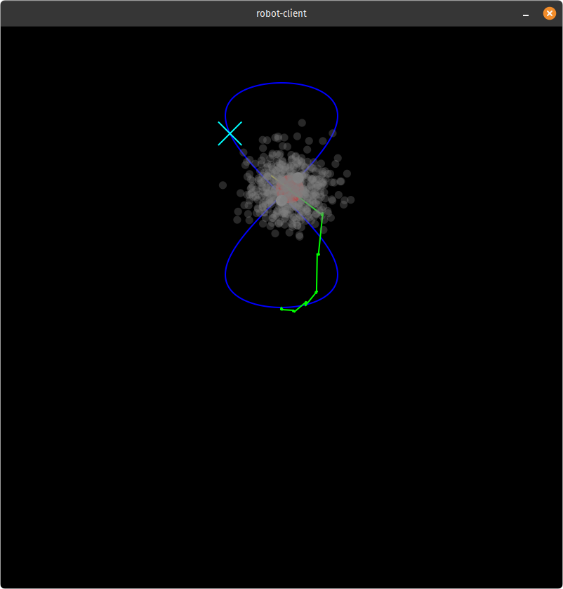

# Writeup

Each section lists it's relevant files, describes the implementation at a high level, and suggests further work to be done.

## Building and Dependency Management

- `pixi.toml`
- `CMakeLists.txt`

This is a C++ project built with cmake, with a few dependencies including nlohmann json, websocketpp, qt6, boost, and opengl. To install these dependencies, pixi is used to install packages and solve dependencies and is compatible with many systems. A bootstrap script installs pixi, and scripts are provided to allow for quick building, formatting, and starting the application through pixi's `run` command.

## Main Application Loop

- `main.cpp`

The entrypoint for the `robot-client` application, which simply starts a websocket client for the server provided as the first argument. The `message_cb` callback is called everytime the client receives a response from the robot simulator server, and show's most of the control flow. The robot model is updated with newly received sensor data, the next setpoint for the robot is obtained by evaluating the path function at the current lifetime, and then the next control inputs for the robot motors are obtained from the controller based on the robot state and the next setpoint. The input is sent to the websocket server and then all of these steps are visualized in a Qt6 OpenGL window. The message callback will stop processing new data once the score message is received.

## Websocket Client

- `robot_client.h`
- `robot_client.cpp`

The websocket client is relatively straight-forward and is based off of websocketpp examples. It sets up the client to listen to the server and assigns a callback on each response. It's run asynchronously, so incoming messages won't be missed if the message callback is still running. It is also responsible for deserializing the sensor data into a `robot_client::Sensors` object, and for serializing the robot input from a `robot_client::Input` object.

Currently the robot state update is coupled to the message callback rate, which is fine since the callback doesn't take too much time. Ideally, the callback would simply store the data received in an event queue, and the event queue would be processed by a separate loop, especially if more computation time is needed between sensor updates.

## Robot Model and Particle Filter

- `robot_model.h`
- `robot_model.cpp`
- `particle_filter.h`
- `particle_filter.cpp`

The robot model contains all the estimated state of the robot and is updated by the sensor data received from the server. The `robot_client::Sensors` data is processed based on the `message_type` in the `RobotModel::update` function. The `RobotModel` is mostly a wrapper for the particle filter, which is what estimates the robot state.

Ground truth is not known for the robot's state, so we don't know how well we are estimating the robot state other than through the GPS. IMU and GPS data are noisy, and wheel slips are not easily detectable since we don't have encoder data. This is highly non-linear, and filters like Extended Kalman work poorly in this scenario. A particle filter is used for localization, tuned roughly by observing the noise from the sensors at stand-still. Particles are updated using a Monte Carlo simulation, weighted according to their Gaussian likelihood, and then resampled when updated with GPS data. The global coordinate of the robot must be obtained by accumulating the IMU data. Adding more sensors to the robot like lidar, a camera, or wheel encoders could improve state estimation.

## Path Generator

- `path_generator.h`
- `path_generator.cpp`

This simply evaluates the Leminiscate of Gerono variation at `t` seconds. The evaluation function could be swapped for any function that takes seconds as input and returns a 2d-point, and the robot should be able to follow it.

## Controller

- `controller.h`
- `controller.cpp`

A simple PD controller is used, tuned by hand. Differential drive mixing is used to obtain `v_left` and `v_right` from the linear and angular velocities. This controller would work well with ideal state, however still has the tendency to steer far away from the setpoint in certain scenarios.

Other controllers like Model-Predictive control, Linear Parameter Varying control, or using reinforcement learning are possibilities for further improvement here. There is data loss here as angular and linear velocities are recomputed rather than using the sensor data directly because this isn't stored by the particle filter.

## Visualizer

- `visualizer.h`
- `visualizer.cpp`

The visualizer is written with Qt6 and uses the `paintEvent` to update based on state information. The robot model, path, and setpoint are provided to the visualizer. The image below explains the visualization. Sensor data and state information is simply printed to the console. This could be added to the visualizer. A key, a scale for distance, better particle visualizations, wheel velocities, and interactivity with the mouse for dragging and zooming could improve the visualizer.

### Key

> The red circle is the robot body, with 2 gray circles representing the wheels

> The yellow line denotes the robot's heading.

>  The green line denotes the path taken by the robot.

> The blue line is the full path that the robot should follow (Leminiscate of Gerono).

> The cyan X is the current setpoint.

> The translucent gray dots are the positions of the particles from the particle filter.

## Future Improvements

Other than what was already mentioned:

* Code cleanup and CI
* Unit/Integration testing

## Video

[Download the MP4](https://github.com/Shtaiven/monumental-interview/raw/main/img/robot-client.mp4)
